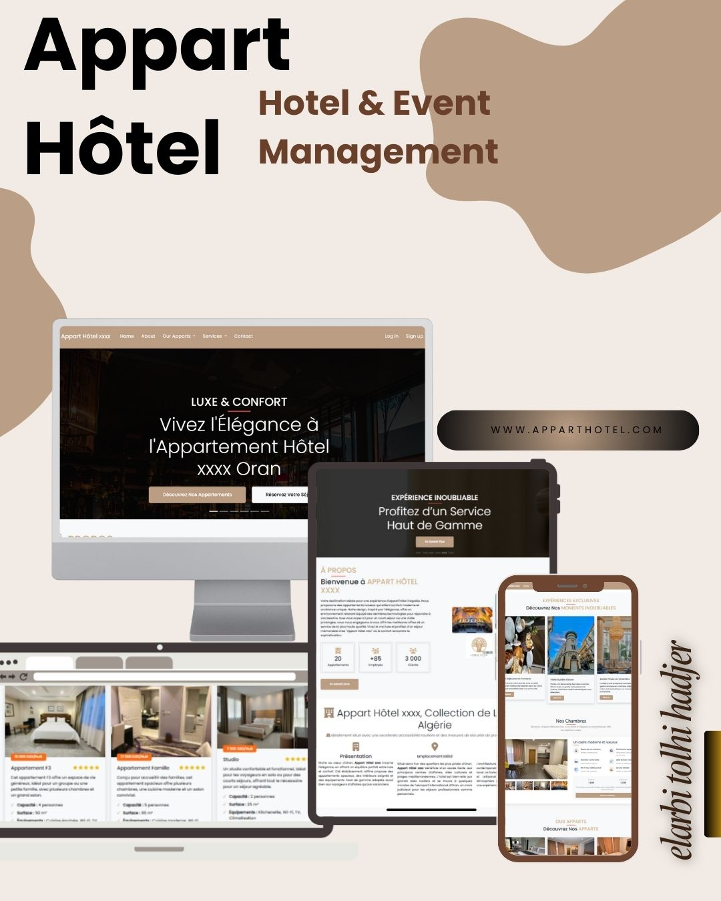
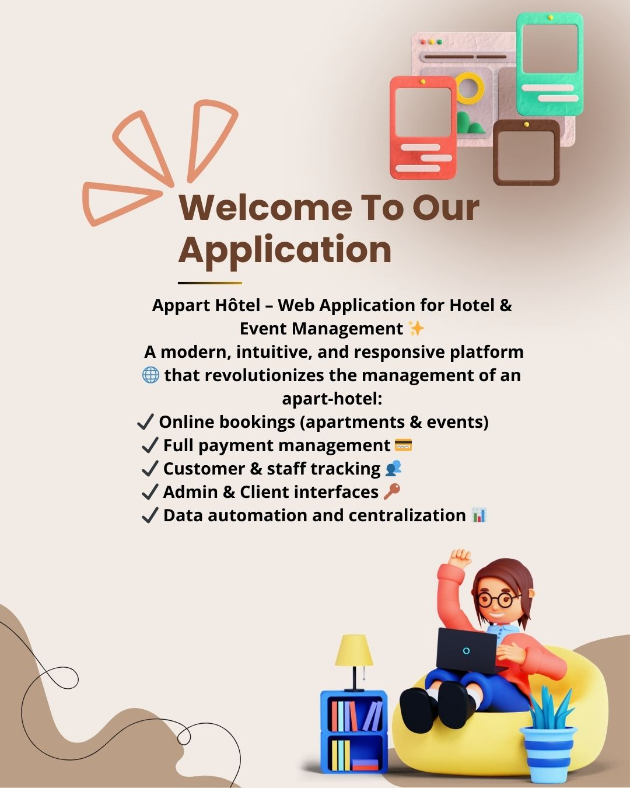
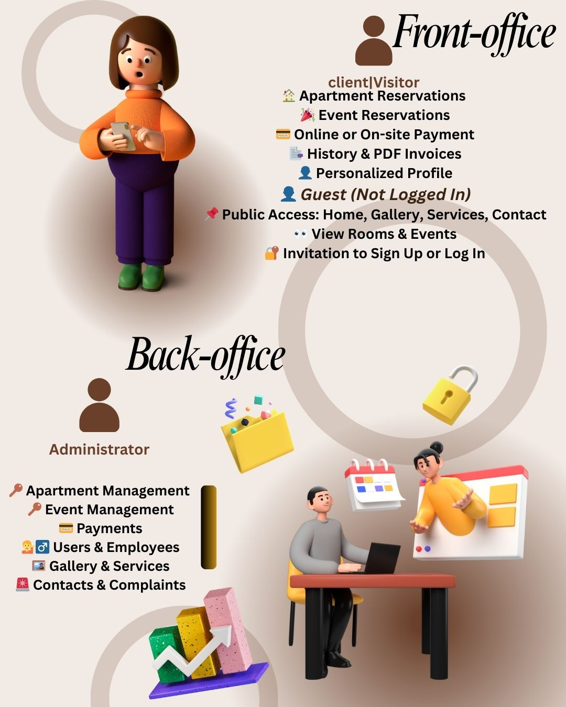
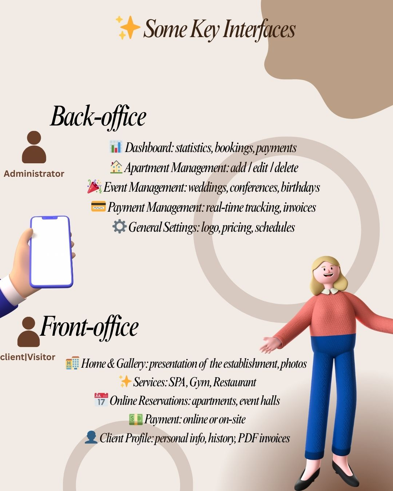
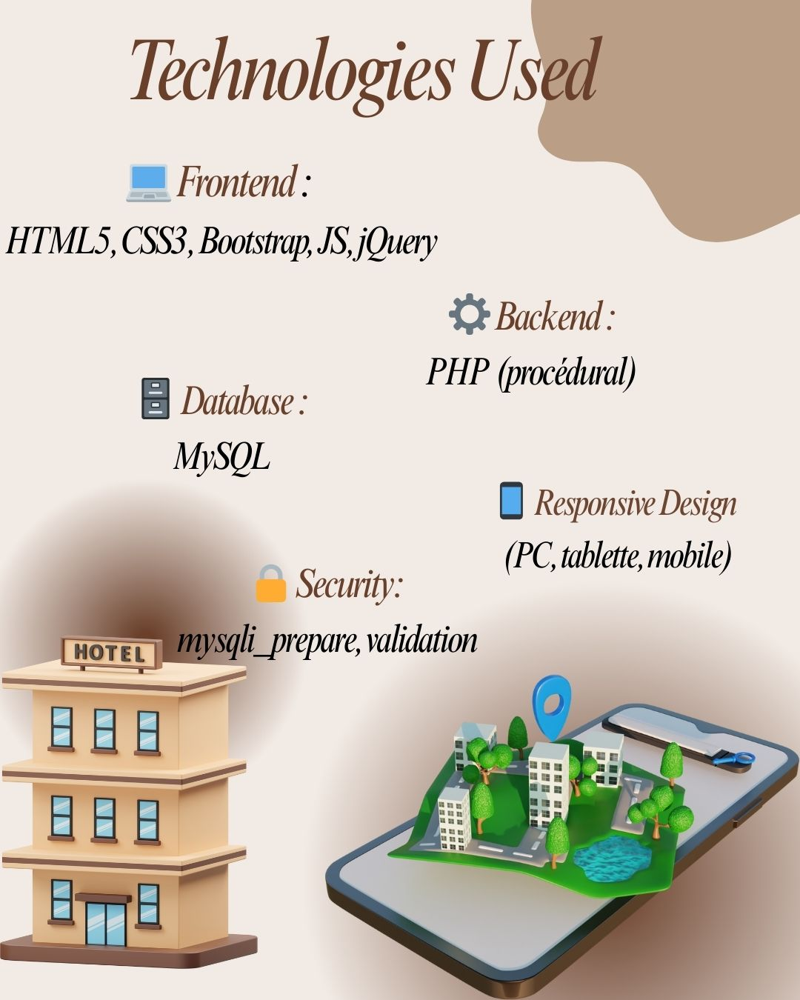
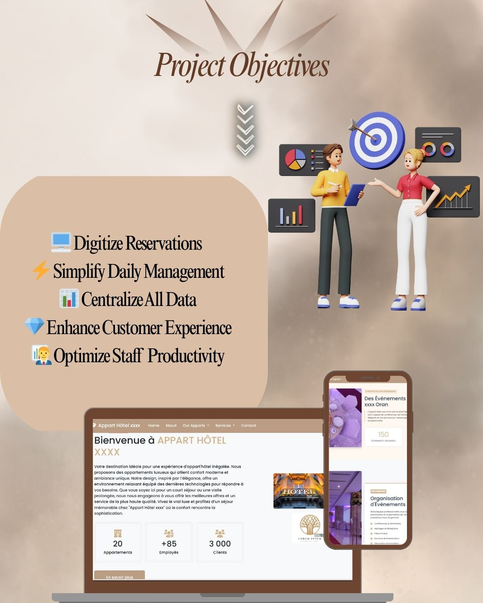
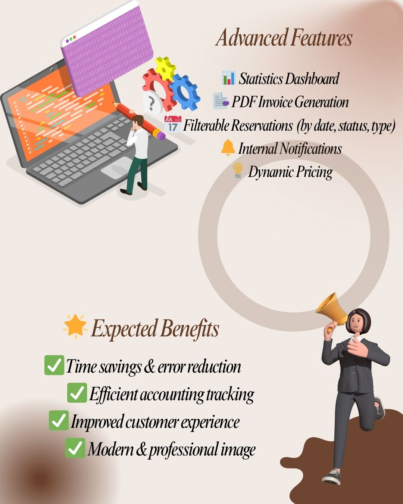
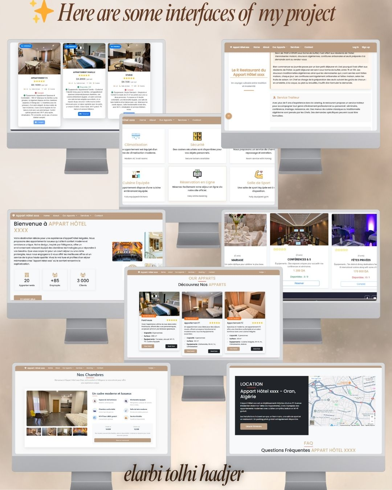
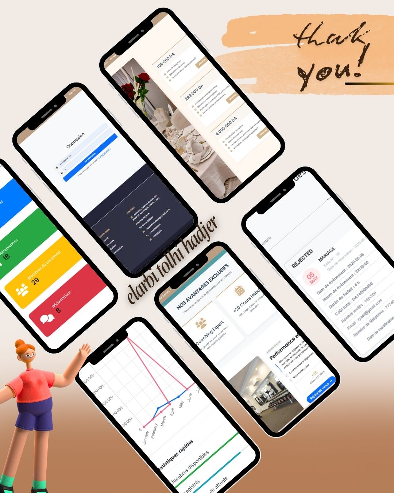

🏨 Appart Hôtel  – Web Application for Hotel & Event Management

✨ Appart Hôtel  is a modern, intuitive, and responsive web platform designed to manage an apart-hotel and its events efficiently.

📌 Overview

This application allows you to:

Digitalize apartment and event reservations.

Simplify daily management (clients, payments, employees).

Provide a user-friendly, responsive interface.

Centralize all data into a single database.

🔑 Core Modules
👨‍💼 Administrator (Back-office)

Apartment Management 🏠

Event Management 🎉

Payment Management 💳

Users & Employees 👥

Gallery & Services 🖼

Contacts & Complaints 📩

General Settings ⚙️

👩‍💻 Client / Visitor (Front-office)

Apartment & Event Reservations 📅

Online or on-site Payments 💵

Reservation History & PDF Invoices 📑

Personalized Profile 👤

Public Access: Home, Gallery, Services, Contact.

⚡ Advanced Features

📊 Dashboard with statistics

📑 Automatic PDF invoice generation

📅 Dynamic filtering of reservations (date, type, status)

💡 Dynamic pricing

🔔 Internal notifications

💻 Technologies Used

Frontend: HTML5, CSS3, Bootstrap, JavaScript, jQuery

Backend: PHP (procedural)

Database: MySQL

Design: Fully responsive (PC, tablet, mobile)

Security: Data validation & mysqli_prepare

🚀 Installation & Setup
🔧 Requirements

Local server: XAMPP, WAMP, or Laragon

Code editor: VS Code or Sublime Text

Browser: Chrome, Firefox…

📥 Steps

Place the project folder in htdocs (e.g., C:\xampp\htdocs\appart-hotel-ryadi).

Import hotel.sql into phpMyAdmin.

Configure the database connection in include/functions.php.

Access the project:

Client → http://localhost/Hotel/index.php

Admin → http://localhost/Hotel/login.php

🔑 Test Accounts

Admin: admin@gmail.com | 123

Client: karim@gmail.com | 123

✅ Expected Benefits

Save time & reduce errors.

Improve accounting & organizational follow-up.

Enhance client experience.

Modernize the establishment’s image.

## 📷 Project Screenshots
Welcome — screenshots & mockups below.

The complete presentation (slides+img + assest + mockups + infographics) is available on Google Drive:  
👉 [View Screenshots et demo on Google Drive](https://drive.google.com/drive/folders/1YAZC-CFT3C6hXnw49gcWhsqGumznexd6?usp=drive_link)

